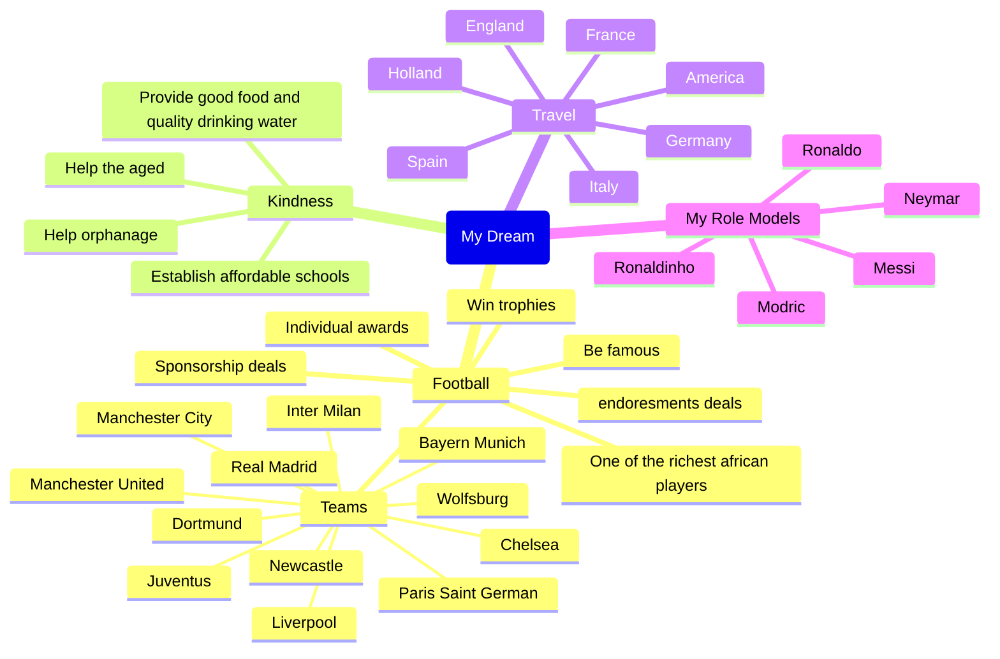
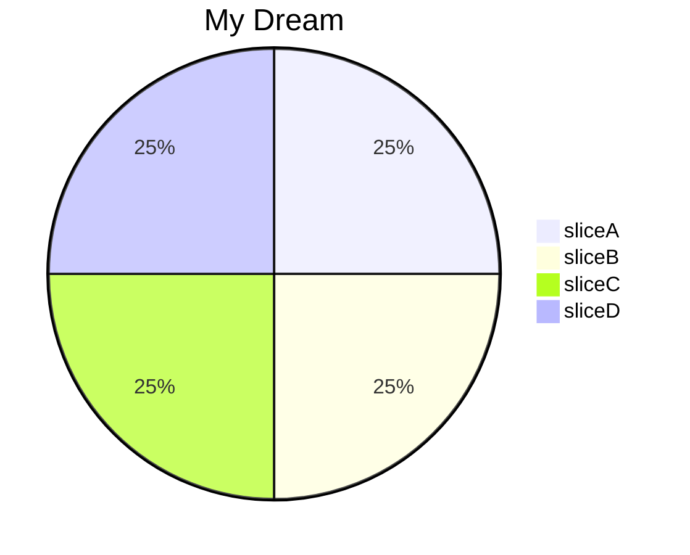
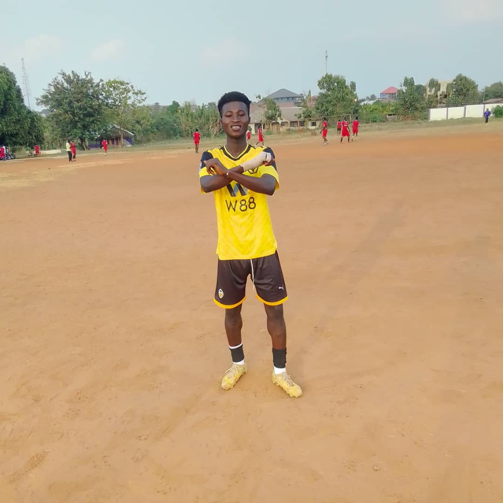
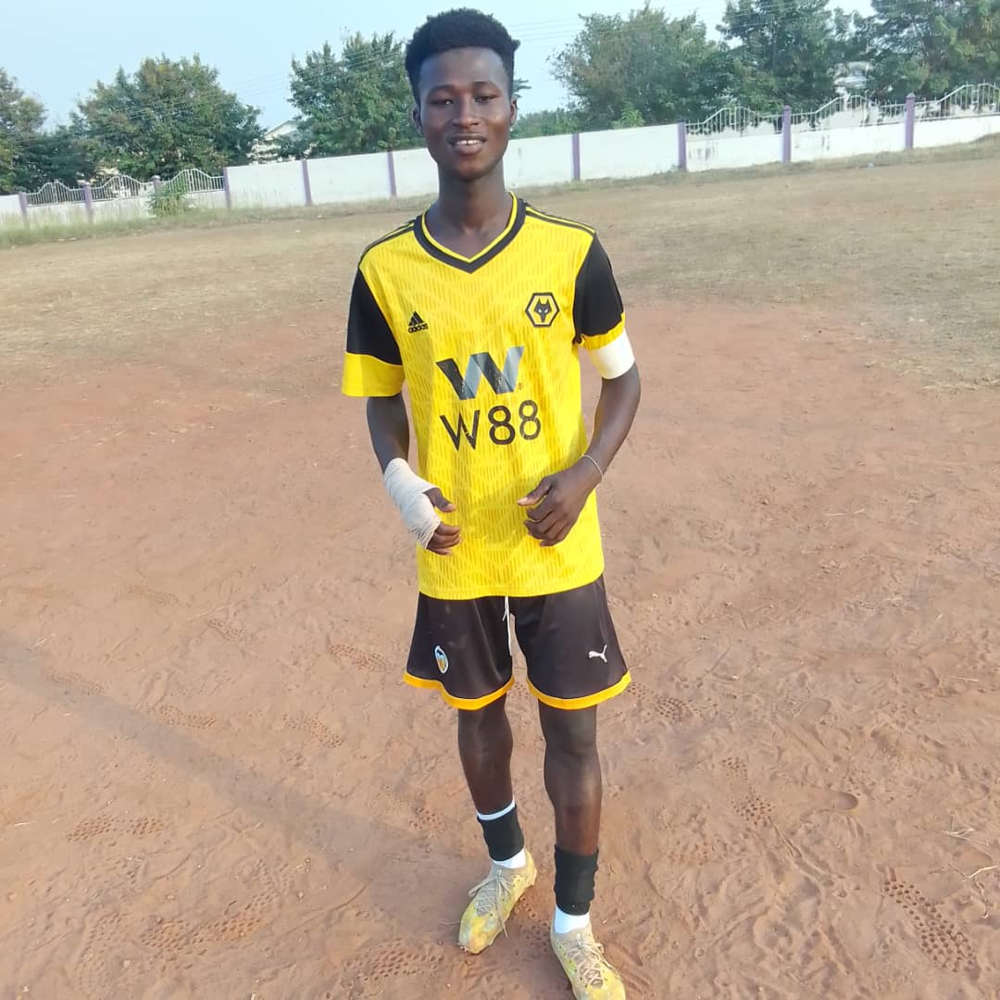
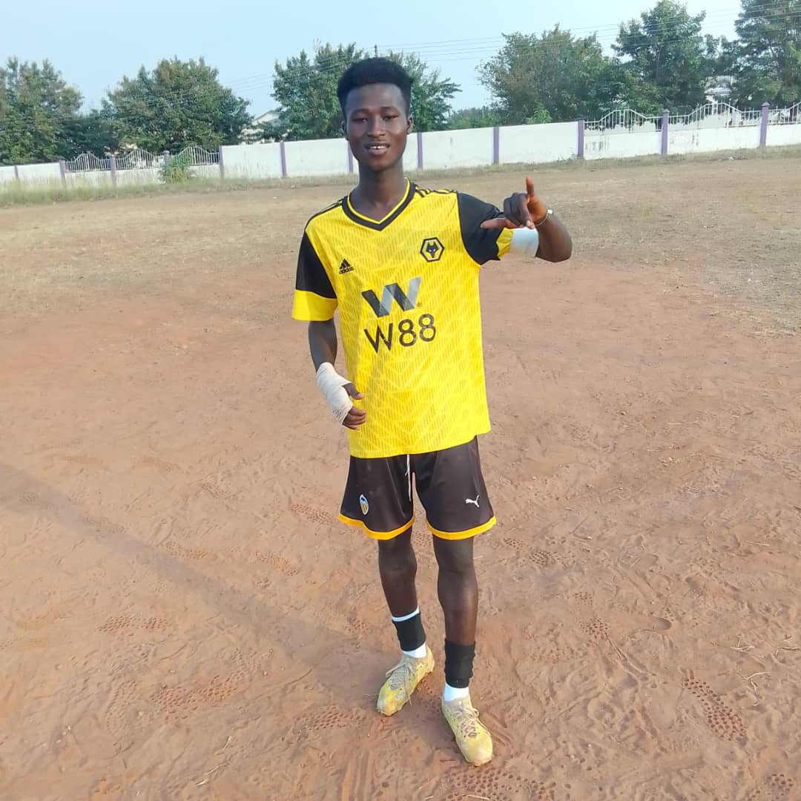
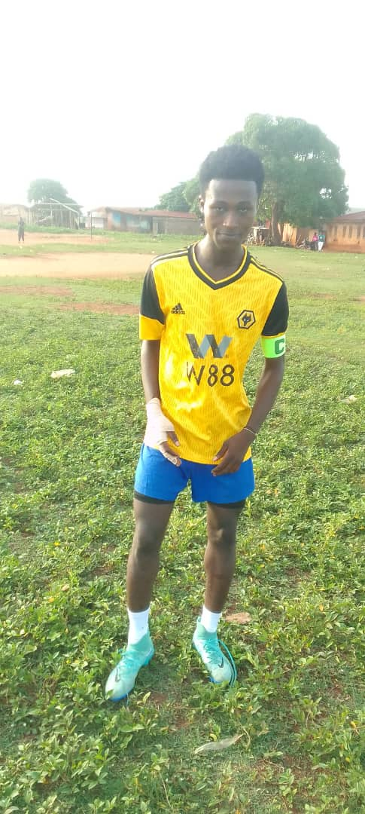

Clicking [this link](ALBUM.md) will take you to the album page.

My name is Emmanuel Kusi a young talented footballer from Ghana in West Africa. I have a dream and I love my dream, I want to become a professional footballer and travel around Europe. I want to become one of the greatest footballers who has ever kicked the ball. I want to win trophies with my country and any club teams I join. I train hard and train my mind very well and I am looking forward to getting an opportunity to make my dream come true. People play football because of the money, others play because of the fame and name, but I play football because I love it, I love the game so much.

